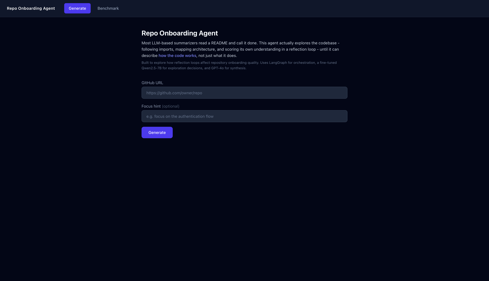
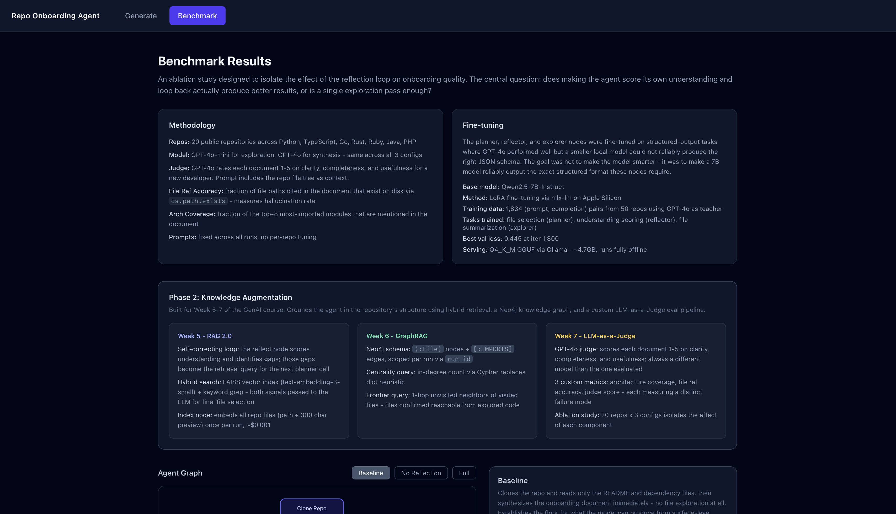
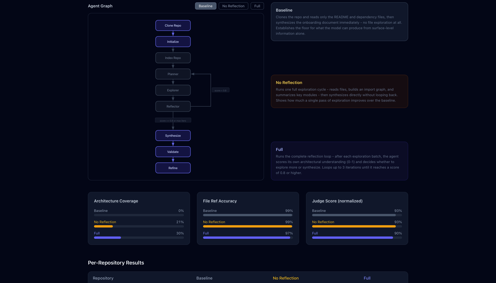
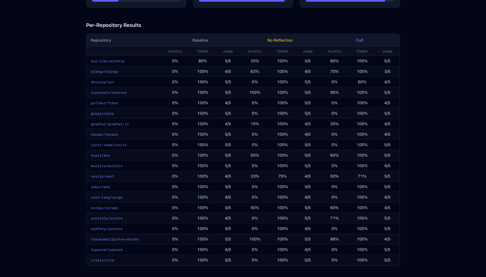
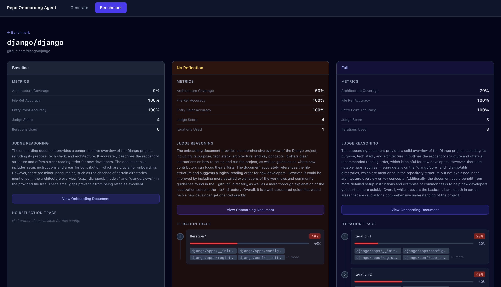

# Repo Onboarding Agent

> An agentic code-understanding system that explores GitHub repositories using a reflection loop, hybrid RAG retrieval, and a Neo4j knowledge graph to produce structured developer onboarding guides.

Most LLM-based repo summarizers read a README and call it done. This agent actually explores the codebase - following imports, mapping architecture, scoring its own understanding, and using vector + graph retrieval to close knowledge gaps - until it can describe **how the code works**, not just what it does.

Built as a portfolio project covering the full GenAI stack: agent design, fine-tuning, hybrid RAG (Phase 2), GraphRAG, and LLM-as-a-Judge evaluation.

## Screenshots

**Generate page** - Enter any GitHub URL, optionally add a focus hint, and watch the agent work in real time. The node timeline shows each step as it fires; on completion the full onboarding document opens in a side drawer.



**Benchmark page - methodology and Phase 2 card** - The top section explains the ablation study methodology, fine-tuning setup, and the three Phase 2 techniques (RAG 2.0, GraphRAG, LLM-as-a-Judge) added for the GenAI course.



**Benchmark page - agent graph and ablation charts** - The SVG agent graph shows which nodes activate per configuration (Baseline / No Reflection / Full). Below it, three bar charts compare architecture coverage, file reference accuracy, and judge score across all three configs for all 20 benchmark repos.



**Benchmark page - per-repository results table** - Every repo in the benchmark with all three metrics per configuration. Rows link through to the repo detail page.



**Repo detail page (django/django)** - Three-column layout showing baseline, no-reflection, and full configs side by side. Each column shows its metrics, judge reasoning, and an expandable iteration stepper with reflection traces per iteration.



## What it does

Point it at any GitHub repo URL. The agent:

1. Clones the repo locally
2. Reads the README, dependency files, and entry points to seed exploration
3. **Builds a FAISS vector index** (RAG 2.0) and initializes the **Neo4j import graph**
4. Plans which files to read next using **hybrid retrieval**: semantic search (FAISS) + graph frontier (Neo4j) + import-graph centrality
5. Summarizes each file, extracts imports, and **syncs edges to Neo4j** as `(:File)-[:IMPORTS]->(:File)`
6. Scores its own architectural understanding (0.0-1.0) after each batch; **reflection notes become the semantic search query** for the next iteration (self-correcting loop)
7. Loops back to explore more files if score < 0.8 (up to 8 iterations max)
8. Synthesizes a full onboarding document, validates every file reference with `os.path.exists`, and refines any broken paths

## Phase 2: Knowledge Augmentation (GenAI Course Weeks 5-7)

### Week 5 - RAG 2.0: Self-correcting retrieval + hybrid search

- **Index node** (`index_repo`): embeds all repo files (path + 300 char preview) into FAISS using `text-embedding-3-small` once per run (~$0.001)
- **Hybrid planner**: on each iteration, queries FAISS with reflection-identified gaps (semantic) + runs Neo4j frontier query (graph) + uses import-graph centrality (keyword). All three signals passed to GPT-4o for final file selection
- **Self-correcting loop**: reflector identifies gaps in natural language -> gap text becomes the vector search query -> semantically similar files retrieved -> explored -> re-scored

### Week 6 - GraphRAG: Neo4j knowledge graph

- **Schema**: `(:File {path, run_id, visited, repo_path})-[:IMPORTS]->(:File)`, one graph per run via `run_id`
- **Centrality query** (Cypher): `MATCH (f)<-[:IMPORTS]-() WHERE f.run_id=$id RETURN f.path, count(*) ORDER BY count DESC` - replaces dict heuristic
- **Frontier query** (Cypher): `MATCH (visited)-[:IMPORTS]->(unvisited) WHERE visited.visited=true AND NOT unvisited.visited=true RETURN DISTINCT unvisited.path` - files one hop from explored code, not yet read
- **Live sync**: explorer node writes new import edges to Neo4j after each batch
- **Frontend**: import graph visualized as SVG with concentric ring layout (most-imported files at center, frontier stubs at edges)
- **Browser UI**: `http://localhost:7474` (neo4j / repoagent123)

### Week 7 - LLM-as-a-Judge evaluation

- GPT-4o judge scores each onboarding document 1-5 on clarity, completeness, and usefulness - always a different model than the one evaluated
- **3 custom metrics**: architecture coverage (fraction of high-import modules mentioned), file ref accuracy (hallucination rate for paths), judge score
- **20-repo ablation**: 3 configurations (baseline / no-reflection / full) isolate the effect of each component

## Benchmark results (20 repos, 3 configurations)

| Config | Judge (1-5) | Arch Coverage | File Ref Accuracy |
|---|---|---|---|
| Baseline (no exploration) | 4.65 | 0.0% | 99.0% |
| No reflection (1 pass) | 4.65 | 21.3% | 98.8% |
| Full (reflection loop) | 4.50 | **29.9%** | 96.6% |

The reflection loop is the key driver of architecture coverage - understanding of core modules improves from 0% to ~30% with the full loop.

## Architecture

```
clone_repo -> initialize_exploration -> index_repo -> plan_next_exploration <--+
                                                             |                  |
                                                       explore_files            |
                                                             |                  |
                                                          reflect ---[score < 0.8 AND iter < max]--+
                                                             |
                                               [score >= 0.8 OR iter >= max]
                                                             |
                                              synthesize -> validate --[errors]--> refine -> END
                                                                |
                                                           [no errors]
                                                                |
                                                               END
```

**New in Phase 2:**
- `index_repo`: FAISS + Neo4j initialization (runs once, between initialize and plan)
- `plan_next_exploration`: now queries FAISS (semantic) + Neo4j (frontier + centrality) before calling GPT-4o
- `explore_files`: syncs new import edges to Neo4j after each batch

## LLM routing

Two modes controlled by `LOCAL_LLM_BASE_URL` in `.env`:

**Cloud mode** (default):
- `gpt-4o` - planner, reflector, synthesizer, refiner
- `gpt-4o-mini` - per-file summaries (~10x cheaper)
- `text-embedding-3-small` - FAISS index (one call per run, ~$0.001)

**Hybrid mode** (`LOCAL_LLM_BASE_URL=http://localhost:11434/v1`):
- Fine-tuned Qwen2.5-7B via Ollama - planner, reflector, explorer
- `gpt-4o` - synthesizer, refiner (always)
- Cost: ~$0.04/repo (synthesis only)

## Fine-tuning

Training data collected by running the agent on 50 repos with GPT-4o, capturing every `(prompt, completion)` pair. 1,834 examples (explorer=1,072, planner=381, reflector=381).

Fine-tuned Qwen2.5-7B-Instruct with MLX LoRA on Apple Silicon. Best val loss 0.445 at iter 1800. Fused and converted to Q4_K_M GGUF for Ollama serving.

```bash
bash fine_tuning/fuse_and_convert.sh   # one-time: fuse + convert + register with Ollama
```

## Setup

Requires [uv](https://github.com/astral-sh/uv), Python 3.11+, and Docker.

```bash
uv sync --extra dev
cp .env.example .env
# Set OPENAI_API_KEY, NEO4J_URI, NEO4J_USERNAME, NEO4J_PASSWORD in .env
```

## Running

```bash
# Terminal 1 - Redis + Neo4j
docker-compose up

# Terminal 2 - API server
uv run uvicorn src.api.main:app --reload

# Terminal 3 - Frontend
cd frontend && npm install && npm run dev
```

Open `http://localhost:5173`. Neo4j browser at `http://localhost:7474`.

## Tests

```bash
uv run pytest tests/
```

## Eval

```bash
uv run python -m src.eval.benchmark                          # full 20-repo ablation
uv run python -m src.eval.benchmark --repos django/django    # single repo
uv run python -m src.eval.benchmark --configs baseline full  # specific configs
```

Results saved to `eval/results.json` (gitignored, regenerate before using benchmark page).

## Project phases

| Phase | Status | Description |
|---|---|---|
| 1 - Core agent | Complete | clone, initialize, plan, explore, reflect nodes |
| 2 - Synthesis + fine-tuning | Complete | synthesize, validate, refine + Qwen2.5-7B LoRA |
| 3 - Eval framework | Complete | 20-repo ablation, metrics, LLM-as-judge |
| 4 - API + Frontend | Complete | FastAPI SSE streaming, Redis job store, React UI |
| 5 - Knowledge Augmentation | Complete | RAG 2.0 (FAISS hybrid), GraphRAG (Neo4j), frontend viz |
| 6 - Deployment | Pending | Docker full stack, production config |

## Tech stack

- **Agent orchestration:** LangGraph 0.2+
- **LLM framework:** LangChain 0.3+ with langchain-openai, langchain-community
- **Vector search:** FAISS (langchain-community) + text-embedding-3-small
- **Graph DB:** Neo4j 5 via official async driver - import graph as property graph
- **API:** FastAPI + sse-starlette + Redis (job persistence + pub/sub streaming)
- **Frontend:** React 18 + Vite + React Router + Tailwind CSS v4 + react-markdown
- **Repo access:** GitPython
- **Code parsing:** `ast` stdlib (Python), regex (JS/TS)
- **Fine-tuning:** mlx-lm (LoRA, Apple Silicon) + Ollama (GGUF serving)
- **Packaging:** uv + pyproject.toml
- **Tests:** pytest + pytest-asyncio + pytest-mock
